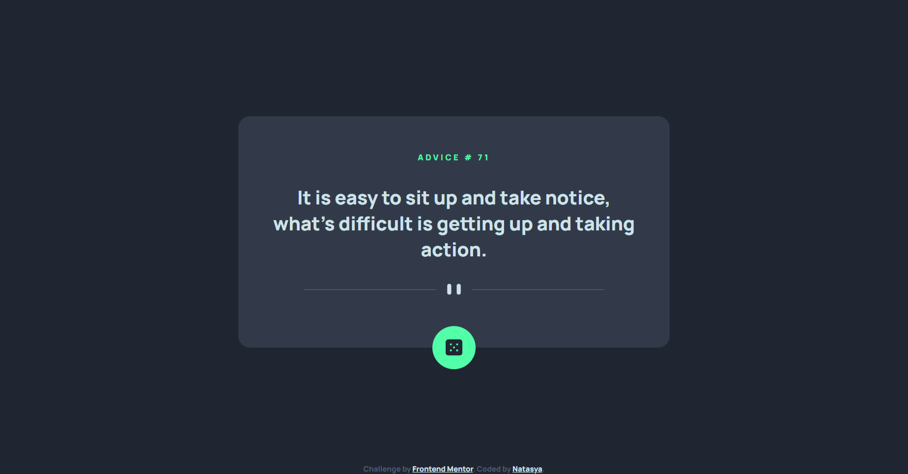

# Frontend Mentor - Advice generator app solution

This is a solution to the [Advice generator app challenge on Frontend Mentor](https://www.frontendmentor.io/challenges/advice-generator-app-QdUG-13db). Frontend Mentor challenges help you improve your coding skills by building realistic projects.

## Table of contents

- [Overview](#overview)
  - [The challenge](#the-challenge)
  - [Screenshot](#screenshot)
  - [Links](#links)
- [My process](#my-process)
  - [Built with](#built-with)
  - [What I learned](#what-i-learned)
  - [Continued development](#continued-development)
  - [Useful resources](#useful-resources)
- [Author](#author)

## Overview

### The challenge

Users should be able to:

- View the optimal layout for the app depending on their device's screen size
- See hover states for all interactive elements on the page
- Generate a new piece of advice by clicking the dice icon

### Screenshot

### Links

- Solution URL: [https://github.com/notanut/advice-generator.git](https://github.com/notanut/advice-generator.git)
- Live Site URL: [https://advice-generator-gray.vercel.app/](https://advice-generator-gray.vercel.app/)

## My process

### Built with

- Semantic HTML5 markup
- CSS custom properties
- Flexbox

### What I learned

I've already known almost everything in this challenge. But this is still fun to do!

### Continued development

I wanna take my programming journey into advanced level. Recently, I'm just playing around. So I think it's time to purge

### Useful resources

- [The Coding Train's Tutorial](https://youtu.be/tc8DU14qX6I) - This video is so helpful to learn how to work with Data & API with JavaScript

## Author

- Frontend Mentor - [@notanut](https://www.frontendmentor.io/profile/notanut)